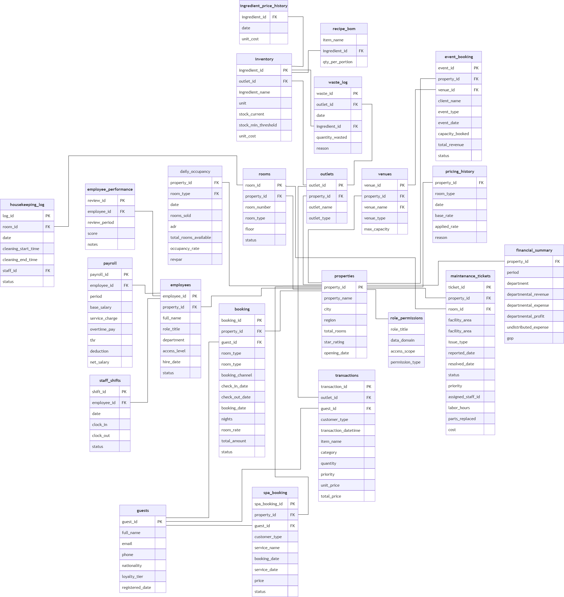

# IndoHotel Data Warehouse


## 👥 สมาชิกในกลุ่ม (Team Members)
* **673020253-2 ธนพล ท้าวนอ**
* **673020255-8 บุญญานุช นันดี**
* **673020271-0 อุดมศักดิ์ พระเสนา**
* **673020627-7 ศุภณัฏฐ์ ปุณมา**
* **673020638-7 พิชญธิดา ขัตติยะ**
* **673020639-5 ศศิภัทชา เจียรเจริญกิจ**

---

## 🏨 ข้อมูลจำเพาะของโครงงาน (Domain & Architecture)
* **Domain:** ธุรกิจโรงแรมและรีสอร์ท (ครอบคลุมการจองห้องพัก, อาหารและเครื่องดื่ม F&B, สปา, การจัดงาน/Venue และทรัพยากรบุคคล HR) 
  * **Dataset Source:** อ้างอิงชุดข้อมูลจำลองการดำเนินงานกลุ่มโรงแรมจาก [Kaggle: Indonesian Hotel Group Operations Data](https://www.kaggle.com/datasets/ardiyanto24/indonesian-hotel-group-operations-data?select=corporate_master)
* **Operational Database (ER Diagram):** ออกแบบระบบ OLTP แบบ Normalized (3NF) ครบถ้วน 23 ตาราง รองรับการทำงานประจำวัน



* **Data Warehouse (Star Schema):** ออกแบบระบบ OLAP สำหรับวิเคราะห์ข้อมูล ประกอบด้วย:
  * **Fact Tables (5 ตาราง):** เช่น `fact_hotel_bookings`, `fact_fnb_operations`, `fact_hotel_operations_hr`, `fact_ancillary_services`, และ `fact_daily_occupancy`
  * **Dimension Tables (8 ตาราง):** เช่น `dim_date`, `dim_property`, `dim_guest`, `dim_room`, `dim_employee`, `dim_fnb_outlet`, `dim_venue`, และ `dim_event_type`


---

## 📊 คำถามทางธุรกิจ (Business Questions 15 ข้อ)
โปรเจกต์นี้ออกแบบโครงสร้าง Data Warehouse เพื่อรองรับการวิเคราะห์และตอบคำถามเชิงกลยุทธ์ทางธุรกิจรวม **15 ข้อ** ครอบคลุม 4 มิติหลัก ดังนี้:

### 📊 1. รายได้และผลประกอบการ (Revenue & Performance)
* **1. Total Revenue & Nights Sold**
  * **Question:** ภาพรวมผลประกอบการด้านรายได้รวม (Total Revenue) และจำนวนคืนที่มีการเข้าพักรวม (Total Nights Sold) ของโรงแรมทั้ง 5 สาขา อยู่ที่ระดับใด
  * **Data Sources:** `fact_hotel_bookings`, `dim_date`, `dim_property`.
  * **Business Value & Action Plan:** ประเมินขนาดธุรกิจและตั้งเป้าหมาย Sales Target / YoY Growth.
* **2. Seasonality Trend (Revenue Trend)**
  * **Question:** รูปแบบความผันผวนของรายได้ตามฤดูกาล (Seasonality Trend) ในรอบปี มีช่วง Peak Season และ Low Season ในเดือนใดบ้าง
  * **Data Sources:** `fact_hotel_bookings`, `dim_date`, `dim_property`.
  * **Business Value & Action Plan:** บริหารกำลังคน ปิดปรับปรุงช่วง Low Season และทำโปรโมชันพยุงรายได้.
* **3. Weekday vs. Weekend Distribution**
  * **Question:** สัดส่วนรายได้ระหว่างวันธรรมดา (Weekday) และวันหยุดสุดสัปดาห์ (Weekend) มีการกระจายตัวอย่างไร
  * **Data Sources:** `fact_hotel_bookings`, `dim_date`, `dim_property`.
  * **Business Value & Action Plan:** รักษาฐานกลุ่ม Corporate วันธรรมดา และออกแพ็กเกจ Staycation ดันสัดส่วนวันหยุด.
* **4. Ancillary Services Growth Structure**
  * **Question:** โครงสร้างรายได้และปริมาณผู้เข้าใช้บริการเสริม (Event & Venue, F&B, Spa & Wellness) มีสัดส่วนการเติบโตเป็นอย่างไร
  * **Data Sources:** `fact_fnb_operations`, `fact_ancillary_services`, `dim_date`, `dim_property`.
  * **Business Value & Action Plan:** ค้นหา Cash Cow และทำ Cross-selling Package เพิ่มรายได้ต่อหัว (RevPAS/RevPOR).
* **5. Occupancy Rate Efficiency**
  * **Question:** ประสิทธิภาพในการดำเนินงานด้านอัตราการเข้าพักเฉลี่ย (Occupancy Rate) ของแต่ละสาขามีความแตกต่างกันอย่างไร
  * **Data Sources:** `fact_daily_occupancy`, `dim_property`.
  * **Business Value & Action Plan:** ใช้ Dynamic Pricing กับสาขา Occupancy สูง และทำโปรโมชันกระตุ้นสาขาต่ำ.

### **👥 2. ลูกค้าและพฤติกรรม (Customer Analysis)**
* **6. Loyalty Program Repeat Stay Trends**
  * **Question:** อัตราการเข้าพักซ้ำมีแนวโน้มการเติบโตอย่างไรเมื่อจำแนกตามระดับสมาชิก (Loyalty Tier)
  * **Data Sources:** `fact_hotel_bookings`, `dim_guest`, `dim_property`, `dim_date`.
  * **Business Value & Action Plan:** ให้สิทธิประโยชน์เฉพาะกลุ่ม Gold/Platinum และกระตุ้นกลุ่ม None/Silver.
* **7. Top 5 Geographic Nationalities**
  * **Question:** โครงสร้างกลุ่มสัญชาตินักท่องเที่ยวหลัก (Top 5 Geographics) ที่สร้างยอดจองสูงสุดมีสัดส่วนเป็นอย่างไร
  * **Data Sources:** `fact_hotel_bookings`, `dim_guest`, `dim_property`, `dim_date`.
  * **Business Value & Action Plan:** เจาะกลุ่มประเทศหลักอย่าง Indonesia และตลาดยุโรป/ออสเตรเลียด้วย Performance Marketing.
* **8. F&B vs. Spa Behavioral Differences**
  * **Question:** พฤติกรรมการใช้บริการด้านอาหาร (Food) และสปา (Spa) มีความแตกต่างกันอย่างไรระหว่างกลุ่มลูกค้านักท่องเที่ยวในประเทศและต่างชาติ
  * **Data Sources:** `fact_fnb_operations`, `fact_ancillary_services`, `dim_guest`, `dim_date`, `dim_property`.
  * **Business Value & Action Plan:** ออกแพ็กเกจสปาสำหรับต่างชาติ และเมนูอาหารตอบโจทย์ลูกค้าในประเทศ.
* **9. Average Length of Stay (ALOS)**
  * **Question:** ระยะเวลาในการเข้าพักเฉลี่ยต่อครั้ง (Average Length of Stay) ของลูกค้าในแต่ละสาขามีสัดส่วนกี่คืน
  * **Data Sources:** `fact_hotel_bookings`, `dim_guest`, `dim_property`, `dim_date`.
  * **Business Value & Action Plan:** ทำโปรโมชัน "Long-stay Discount" ดันยอดคืนพักในสาขาที่มีค่าเฉลี่ยต่ำ.

### **🛏️ 3. ห้องพักและการจอง (Room & Booking Patterns)**
* **10. Booking Lead Time Patterns**
  * **Question:** พฤติกรรมการวางแผนเดินทางของลูกค้าผ่านระยะเวลาการจองล่วงหน้าเฉลี่ย (Lead Time) มีระยะเวลากี่วัน
  * **Data Sources:** `fact_hotel_bookings`, `dim_property`, `dim_date`.
  * **Business Value & Action Plan:** กำหนดช่วงปล่อยโปรโมชัน "Early Bird" และ Last-minute pricing ใกล้วันเข้าพัก.
* **11. Room Type Revenue & Booking Structure**
  * **Question:** โครงสร้างรายได้และปริมาณยอดจองเมื่อจำแนกตามประเภทห้องพัก (Suite, Deluxe, Villa, Standard) มีลักษณะอย่างไร
  * **Data Sources:** `fact_hotel_bookings`, `dim_room`, `dim_property`, `dim_date`.
  * **Business Value & Action Plan:** ปรับ Room Mix และทำ Up-selling จาก Standard ไป Deluxe/Suite.
* **12. Room Cancellation Risk Analysis**
  * **Question:** ห้องพักแต่ละประเภทมีอัตราการยกเลิกกี่เปอร์เซ็นต์ และประเภทไหนมีความเสี่ยงที่จะถูกยกเลิกสูงที่สุด
  * **Data Sources:** `fact_hotel_bookings`, `dim_room`, `dim_property`, `dim_date`.
  * **Business Value & Action Plan:** กำหนดนโยบาย Non-refundable rate สำหรับห้องที่มีอัตราการยกเลิกสูง.

### **📅 4. ปฏิบัติการและสถานที่ (Operations & Venue)**
* **13. Venue Utilization Volume**
  * **Question:** พื้นที่จัดงานประเภทใด (Ballroom, Meeting Room, Outdoor) ที่ได้รับการจองใช้บริการสูงสุด
  * **Data Sources:** `fact_ancillary_services`, `dim_venue`, `dim_property`, `dim_date`.
  * **Business Value & Action Plan:** วางแผนปรับปรุง Ballroom ยอดจองสูงสุด และเพิ่มแพ็กเกจ Meeting Room/Outdoor.
* **14. Event Type Frequency (High Volume)**
  * **Question:** ประเภทของงานจัดเลี้ยง/ประชุม (Event Category) ใดที่มีความถี่ในการจัดงานสูงสุด
  * **Data Sources:** `fact_ancillary_services`, `dim_event_type`, `dim_date`, `dim_property`.
  * **Business Value & Action Plan:** มุ่งเน้น B2B Marketing เจาะกลุ่มลูกค้าองค์กรเพื่อสร้างยอดจองประชุมสม่ำเสมอ.
* **15. Event Revenue Drivers (High Value)**
  * **Question:** งานจัดเลี้ยงประเภทใดที่สร้างมูลค่ารายได้รวมสูงสุด (Revenue Drivers) ให้แก่โรงแรม
  * **Data Sources:** `fact_ancillary_services`, `dim_event_type`, `dim_date`, `dim_property`.
  * **Business Value & Action Plan:** ผลักดันงาน Wedding แพ็กเกจใหญ่ราคาสูงคู่กับงาน Corporate เพื่อสร้างกระแสเงินสด.

---

## 🔄 กระบวนการ ETL / ELT Pipeline
กระบวนการ ETL/ELT ของโปรเจกต์นี้ใช้สถาปัตยกรรม **Modern Data Stack (dbt + DuckDB)** ในการสกัด แปลง และโหลดข้อมูลจากระบบปฏิบัติการ (OLTP) เข้าสู่ Data Warehouse (OLAP) โดยแบ่งออกเป็น 3 ขั้นตอนหลัก:

---

### 1. Extract (การสกัดข้อมูลดิบ)
* **Data Sources:** สกัดข้อมูลดิบจากไฟล์ Flat Files (CSV ทั้งหมด 23 ไฟล์) ในโฟลเดอร์ `datasets/` ซึ่งจำลองจากระบบปฏิบัติการของโรงแรม
* **DuckDB Source Integration:** ใช้ไฟล์กำหนดค่า `src_indohotel.yml` เพื่อเชื่อมต่อ DuckDB เข้ากับไฟล์ CSV โดยตรง ทำให้สามารถ Query ข้อมูลดิบได้ด้วย SQL โดยไม่ต้องโหลดเข้า Database อื่นก่อน

---

### 2. Transform (การแปลงและทำความสะอาดข้อมูล)

กระบวนการ Transform แบ่งออกเป็น 2 ชั้นหลัก (Layered Architecture):

#### **A. Staging Layer (`stg_*.sql`):**
ทำความสะอาดข้อมูลดิบ จัดระเบียบชนิดข้อมูล (Type Casting) และใส่ Business Logic ระดับเริ่มต้นรวม 23 โมเดล โดยเฉพาะตาราง **`stg_guests`** ที่ต้องผ่านกระบวนการ Data Cleaning เชิงลึก เนื่องจาก **ข้อมูลดิบ (Raw Data) ในไฟล์ CSV ต้นทางมีความสกปรกและไม่เป็นมาตรฐาน (Messy & Inconsistent Data)** ดังนี้:
* **การแก้ปัญหาความหมายเดียวกันแต่เขียนไม่เหมือนกัน (Variations & Synonyms):** ข้อมูลดิบปะปนกันระหว่างชื่อประเทศ ชื่อเมือง และดินแดน (เช่น มีทั้ง `'KOREA'`, `'SOUTH KOREA'`, `'REPUBLIC OF KOREA'`, `'SEOUL'`, `'BUSAN'`) จึงต้องใช้ `CASE WHEN` ร่วมกับ `upper()` และ `trim()` เพื่อรวมให้เป็นมาตรฐานสากลเดียวคือ `'South Korea'`
* **การแก้ปัญหาคำย่อและรูปแบบไม่เป็นทางการ (Abbreviations):** แปลงคำย่อกระจัดกระจาย เช่น `'USA'`, `'US'`, `'UK'`, `'PRC'`, `'UAE'` ให้เป็นชื่อทางการที่ถูกต้อง
* **การจัดการชื่อประเทศทางประวัติศาสตร์หรือชื่อทางการยาวๆ (Historical & Formal Names):** แปลงชื่อเก่าหรือชื่อทางการ เช่น `'SWAZILAND'` เป็น `'Eswatini'` หรือ `'LIBYAN ARAB JAMAHIRIYA'` เป็น `'Libya'`
* **การจัดการค่าว่างและความผิดปกติ (Nulls, Blanks & Typos):** ดักเคสค่าที่เป็น `NULL`, ข้อความว่าง (`''`), หรือดินแดนกำกวม ให้ถูกจัดหมวดหมู่รวมกันไปที่ `'Others'` อย่างปลอดภัย
* **Metadata Logging:** เพิ่มฟิลด์ `ingestion_timestamp` ด้วย `current_localtimestamp()` เพื่อบันทึกเวลาที่ข้อมูลถูกดึงเข้าสู่ Pipeline
* **Staging อื่นๆ:** เช่น `stg_bookings` (ทำความสะอาดสถานะการจอง), `stg_fnb_transactions` (คำนวณราคาขายและต้นทุน), และ `stg_employees` (จัดกลุ่มแผนกและระดับการเข้าถึง)

#### **B. Warehouse Layer (`dim_*.sql` และ `fact_*.sql`):**
รวมข้อมูลจาก Staging Layer มาสร้างเป็น **Star Schema** รวม 13 ตาราง:
* **Surrogate Key Generation:** สร้าง Primary Key ใหม่ของตาราง Dimension โดยการทำ Hashing แบบ MD5 จาก Business Keys (เช่น `guest_key`, `property_key`, `room_key`) และสร้าง `date_key` แบบ Integer (`YYYYMMDD`)
* **Fact Calculation & Metrics:** คำนวณค่าตัวชี้วัดเชิงปริมาณ (Measures) เช่น `total_revenue`, `cost_of_goods_sold`, `waste_cost`, `lead_time_days`, `occupancy_rate`, `adr`, และ `revpar`

---

### 3. Load & Data Quality Testing (การโหลดและการทดสอบข้อมูล)
* **Automated Load Execution:** โหลดข้อมูลที่แปลงแล้วลงสู่คลังข้อมูล DuckDB ด้วยคำสั่ง `dbt run` โดยระบบจะจัดการลำดับการสร้างตาราง Dimension ก่อน Fact Tables เพื่อรักษาความสัมพันธ์ของข้อมูล (Referential Integrity)
* **Data Quality Control:** ทำการทดสอบคุณภาพข้อมูลอัตโนมัติด้วยคำสั่ง `dbt test` ครอบคลุม 24 Data Tests ผ่านไฟล์ `schema.yml`:
  * **`unique` Test:** ตรวจสอบความซ้ำซ้อนของ Surrogate Primary Keys ในทุก Dimension Tables
  * **`not_null` Test:** ตรวจสอบว่าไม่มีค่า Null ในคอลัมน์ Primary Keys และ Business Keys สำคัญ
* **ผลการทดสอบ:** ผ่านการทดสอบคุณภาพข้อมูลสำเร็จ 100%

---

## 📈 Interactive Dashboard (Streamlit)

แพลตฟอร์มการแสดงผลข้อมูลเชิงโต้ตอบ (Interactive Dashboard) พัฒนาขึ้นด้วย **Streamlit** เชื่อมต่อโดยตรงกับ DuckDB Data Warehouse เพื่อตอบโจทย์คำถามเชิงกลยุทธ์ทั้ง 15 ข้อขององค์กร

* **🔗 ลิงก์เข้าชมระบบ:** [👉 คลิกที่นี่เพื่อใช้งาน Streamlit Dashboard (INDOHOTEL)](https://projectdatawarehouse-tee-we-lux.streamlit.app/)

| แท็บการใช้งาน (Tab) | ตัวชี้วัดสำคัญ (Key Metrics) | กราฟและเครื่องมือวิเคราะห์ (Visualizations) |
| :--- | :--- | :--- |
| **1. รายได้และผลประกอบการ** | ยอดขายรวม (Total Revenue), จำนวนคืนที่จอง (Nights) | • กราฟเส้นแนวโน้มรายได้ตามช่วงเดือน/ฤดูกาล<br>• กราฟโดนัทสัดส่วนยอดขายวันธรรมดา vs วันหยุดสุดสัปดาห์<br>• การแสดงผลสัดส่วนรายได้และผู้ใช้บริการเสริม (F&B, Spa, Event)<br>• กราฟอัตราการเข้าพักเฉลี่ย (Occupancy Rate) แยกตามสาขา |
| **2. ลูกค้าและพฤติกรรม** | ค่าเฉลี่ยการเข้าพักซ้ำตาม Loyalty Tier, สัญชาติลูกค้า Top 5 | • กราฟแท่งแสดงอัตราการเข้าพักซ้ำตามระดับสมาชิก<br>• กราฟแท่งแนวนอนแสดงสัญชาติลูกค้าสูงสุด 5 อันดับแรก<br>• กราฟเปรียบเทียบการใช้บริการ Food และ Spa ระหว่างลูกค้าในประเทศและต่างชาติ<br>• กราฟระยะเวลาเข้าพักเฉลี่ย (Nights Stayed) ตามสาขาโรงแรม |
| **3. ห้องพักและการจอง** | ระยะเวลาการจองล่วงหน้าเฉลี่ย (Lead Time) | • กราฟแท่งแสดงประเภทห้องพักที่สร้างรายได้หลักสูงสุดพร้อมจำนวนการจอง<br>• กราฟแท่งแสดงอัตราการยกเลิกการจอง (%) แยกตามประเภทห้องพัก |
| **4. ปฏิบัติการและสถานที่** | จำนวนการจองสถานที่และรายได้จากการจัดงาน | • กราฟแท่งแสดงประเภทสถานที่จัดงาน (Venue Type) ที่มีการจองสูงสุด<br>• กราฟเปรียบเทียบจำนวนครั้งและรายได้รวมแยกตามประเภทกิจกรรมจัดงาน (Event Type Breakdown) |
---

## 🚀 วิธีการรันโปรเจกต์ (Quickstart Guide)

ทำตามขั้นตอนด้านล่างเพื่อรันโปรเจกต์ในเครื่องของคุณ:

0. **Set up the environment**
   ```bash
   python3 -m venv .venv
   source .venv/bin/activate
   ```
1. **โคลน Repository และเข้าไปที่โฟลเดอร์โปรเจกต์:**
   ```bash
   git clone https://github.com/Thanaphon-673020253-2/project_DW.git
   ```
2. **Install requirements package**
   ```bash
   pip install --upgrade pip
   pip install -r requirements.txt
   ```
3. **Run DBT**
   ```bash
   cd indohotel
   dbt debug
   dbt run
   dbt test
   cd ..
   ```
4. **Run Streamlit for view Dashboard**
   ```bash
   streamlit run app.py
   ```

   