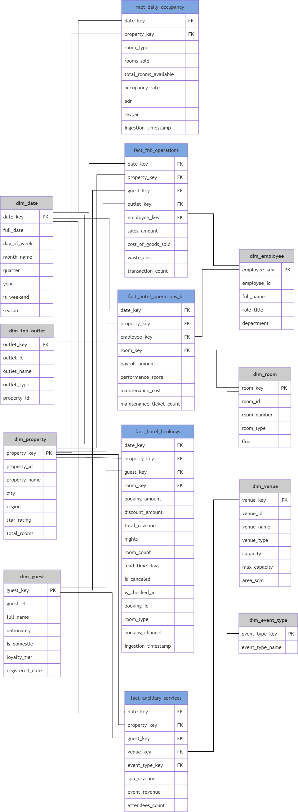

# IndoHotel Data Warehouse

Data Warehouse สำหรับวิเคราะห์การดำเนินงานของธุรกิจโรงแรมและรีสอร์ท โดยใช้ **dbt + DuckDB + Streamlit** ตั้งแต่การเตรียมข้อมูลดิบ การทำ Data Transformation การสร้าง Galaxy Schema ไปจนถึง Interactive Dashboard

---

## 👥 สมาชิกในกลุ่ม (Team Members)

* **673020253-2 ธนพล ท้าวนอ**
* **673020255-8 บุญญานุช นันดี**
* **673020271-0 อุดมศักดิ์ พระเสนา**
* **673020627-7 ศุภณัฏฐ์ ปุณมา**
* **673020638-7 พิชญธิดา ขัตติยะ**
* **673020639-5 ศศิภัทชา เจียรเจริญกิจ**

---

## 🏨 ข้อมูลจำเพาะของโครงงาน (Domain & Architecture)

### Domain

โครงงานอยู่ใน Domain ของ **ธุรกิจโรงแรมและรีสอร์ท** ครอบคลุมกระบวนการสำคัญ ได้แก่

* การจองห้องพัก (Hotel Booking)
* อาหารและเครื่องดื่ม (F&B)
* Spa
* Event และ Venue
* Occupancy
* Employee และ Hotel Operations

### Dataset Source

ใช้ชุดข้อมูลจำลองการดำเนินงานของกลุ่มโรงแรมจาก:

[Kaggle — Indonesian Hotel Group Operations Data](https://www.kaggle.com/datasets/ardiyanto24/indonesian-hotel-group-operations-data)

### Architecture

โครงงานแบ่งออกเป็น 2 ส่วนหลัก

```text
Raw Dataset
     │
     ▼
Staging Layer
     │
     ▼
Data Warehouse
     │
     ▼
Streamlit Dashboard
```

---

### Operational Database (ER Diagram)

ระบบต้นทางเป็นข้อมูลเชิงปฏิบัติการที่มีโครงสร้างแบบ Relational Database โดยข้อมูลต้นทางถูกนำมาเตรียมเข้าสู่ Staging Layer ก่อนสร้าง Data Warehouse


---

### Data Warehouse (Galaxy Schema)

Data Warehouse ใช้แนวคิด **Dimensional Modeling / Galaxy Schema**

ประกอบด้วย

#### Fact Tables — 5 ตาราง

| Fact Table                 | หน้าที่                                                        |
| -------------------------- | -------------------------------------------------------------- |
| `fact_hotel_bookings`      | ข้อมูลการจองห้องพัก รายได้ จำนวนคืน Lead Time และ Cancellation |
| `fact_fnb_operations`      | รายได้และต้นทุนจาก F&B                                         |
| `fact_ancillary_services`  | ข้อมูลบริการเสริม Spa และ Event                                |
| `fact_daily_occupancy`     | Occupancy, ADR และ RevPAR รายวัน                               |
| `fact_hotel_operations_hr` | Payroll, Employee Performance และ Maintenance                  |

#### Dimension Tables — 8 ตาราง

| Dimension Table  | หน้าที่                                 |
| ---------------- | --------------------------------------- |
| `dim_date`       | วัน เดือน ปี ฤดูกาล และ Weekday/Weekend |
| `dim_property`   | ข้อมูลโรงแรม/สาขา                       |
| `dim_guest`      | ข้อมูลลูกค้า สัญชาติ และ Loyalty Tier   |
| `dim_room`       | ข้อมูลห้องพักและประเภทห้อง              |
| `dim_employee`   | ข้อมูลพนักงาน                           |
| `dim_fnb_outlet` | ข้อมูล Outlet ของ F&B                   |
| `dim_venue`      | ข้อมูลสถานที่จัดงาน                     |
| `dim_event_type` | ข้อมูลประเภท Event                      |



รายละเอียดการออกแบบจาก Business Questions สามารถดูได้ที่:

**[Business Questions → Data Warehouse Schema Design](./BUSINESS_QUESTIONS_TO_SCHEMA.md)**

---

## 📊 คำถามทางธุรกิจ (Business Questions 15 ข้อ)

Data Warehouse ถูกออกแบบเพื่อรองรับ Business Questions จำนวน **15 ข้อ** โดยแบ่งเป็น 4 กลุ่มหลัก และแต่ละคำถามสามารถนำข้อมูลจาก Fact และ Dimension Tables มาวิเคราะห์เพื่อสนับสนุนการตัดสินใจทางธุรกิจได้

### 📊 1. รายได้และผลประกอบการ (Revenue & Performance)

|     # | Business Question                                                           | Main Data                                        | ตอบปัญหาธุรกิจอย่างไร                                                                                                                                                  |
| ----: | --------------------------------------------------------------------------- | ------------------------------------------------ | ---------------------------------------------------------------------------------------------------------------------------------------------------------------------- |
| **1** | **Total Revenue & Nights Sold** — รายได้รวมและจำนวนคืนที่เข้าพัก            | `fact_hotel_bookings`                            | ช่วยให้ผู้บริหารเห็นภาพรวม **รายได้และจำนวนคืนที่ขายได้** ของโรงแรม สามารถใช้ติดตามผลประกอบการและเปรียบเทียบ Performance ระหว่างช่วงเวลาและสาขา                        |
| **2** | **Seasonality Trend** — แนวโน้มรายได้ตามฤดูกาล                              | `fact_hotel_bookings`, `dim_date`                | ช่วยระบุ **ช่วง Peak Season และ Low Season** จากแนวโน้มรายได้ เพื่อใช้วางแผน Promotion, Pricing และการจัดสรรทรัพยากรในแต่ละช่วง                                        |
| **3** | **Weekday vs. Weekend Distribution** — เปรียบเทียบรายได้วันธรรมดาและวันหยุด | `fact_hotel_bookings`, `dim_date`                | ช่วยให้โรงแรมเข้าใจว่า **รายได้เกิดจาก Weekday หรือ Weekend มากกว่า** และนำไปกำหนดกลยุทธ์ เช่น Corporate Package สำหรับ Weekday หรือ Staycation Package สำหรับ Weekend |
| **4** | **Ancillary Services Growth Structure** — วิเคราะห์ F&B, Spa และ Event      | `fact_fnb_operations`, `fact_ancillary_services` | ช่วยวิเคราะห์ว่า **บริการเสริมประเภทใดสร้างรายได้และมีปริมาณการใช้บริการสูง** เพื่อค้นหา Revenue Driver และวางแผน Cross-selling                                        |
| **5** | **Occupancy Rate Efficiency** — เปรียบเทียบ Occupancy ของแต่ละสาขา          | `fact_daily_occupancy`                           | ช่วยเปรียบเทียบ **ประสิทธิภาพการขายห้องพักของแต่ละสาขา** จาก Occupancy Rate, Rooms Sold, ADR และ RevPAR เพื่อใช้วางแผน Pricing และ Promotion                           |

### 👥 2. ลูกค้าและพฤติกรรม (Customer Analysis)

|     # | Business Question                                                             | Main Data                                                     | ตอบปัญหาธุรกิจอย่างไร                                                                                                                              |
| ----: | ----------------------------------------------------------------------------- | ------------------------------------------------------------- | -------------------------------------------------------------------------------------------------------------------------------------------------- |
| **6** | **Loyalty Program Repeat Stay Trends** — วิเคราะห์พฤติกรรมตาม Loyalty Tier    | `fact_hotel_bookings`, `dim_guest`                            | ช่วยวิเคราะห์พฤติกรรมการจองและการเข้าพักของลูกค้าแต่ละ **Loyalty Tier** เพื่อประเมิน Engagement และวางแผนสิทธิประโยชน์สำหรับลูกค้าแต่ละกลุ่ม       |
| **7** | **Top 5 Geographic Nationalities** — วิเคราะห์สัญชาติที่สร้างยอดจองสูงสุด     | `fact_hotel_bookings`, `dim_guest`                            | ช่วยระบุ **ตลาดลูกค้าหลักตาม Nationality** และดูว่าสัญชาติใดสร้างจำนวน Booking หรือ Revenue สูง เพื่อใช้กำหนด Target Market และ Marketing Campaign |
| **8** | **F&B vs. Spa Behavioral Differences** — เปรียบเทียบพฤติกรรม Domestic/Foreign | `fact_fnb_operations`, `fact_ancillary_services`, `dim_guest` | ช่วยเปรียบเทียบการใช้บริการ **F&B และ Spa ระหว่าง Domestic กับ Foreign Guests** เพื่อออกแบบ Service Package และ Promotion ให้เหมาะกับแต่ละกลุ่ม    |
| **9** | **Average Length of Stay (ALOS)** — วิเคราะห์จำนวนคืนเฉลี่ยต่อ Booking        | `fact_hotel_bookings`                                         | ช่วยให้ทราบว่าแขกแต่ละกลุ่มหรือแต่ละสาขามี **ระยะเวลาเข้าพักเฉลี่ยกี่คืน** เพื่อนำไปวางแผน Long-stay Promotion และเพิ่มจำนวน Nights Sold           |

### 🛏️ 3. ห้องพักและการจอง (Room & Booking Patterns)

|      # | Business Question                                                                 | Main Data                         | ตอบปัญหาธุรกิจอย่างไร                                                                                                                         |
| -----: | --------------------------------------------------------------------------------- | --------------------------------- | --------------------------------------------------------------------------------------------------------------------------------------------- |
| **10** | **Booking Lead Time Patterns** — วิเคราะห์จำนวนวันจองล่วงหน้า                     | `fact_hotel_bookings`             | ช่วยให้โรงแรมเข้าใจว่าแขก **จองห้องล่วงหน้ากี่วัน** เพื่อกำหนดช่วงเวลาสำหรับ Early Bird Promotion และ Last-minute Pricing                     |
| **11** | **Room Type Revenue & Booking Structure** — วิเคราะห์รายได้และยอดจองตามประเภทห้อง | `fact_hotel_bookings`, `dim_room` | ช่วยระบุว่า **Room Type ใดมียอดจองและรายได้สูง** เพื่อใช้ปรับ Room Mix, ราคา และกลยุทธ์ Up-selling                                            |
| **12** | **Room Cancellation Risk Analysis** — วิเคราะห์อัตราการยกเลิกตามประเภทห้อง        | `fact_hotel_bookings`, `dim_room` | ช่วยระบุ **Room Type ที่มี Cancellation Rate สูง** เพื่อประเมินความเสี่ยงและกำหนดนโยบาย เช่น Non-refundable Rate หรือเงื่อนไขการจองที่เหมาะสม |

### 📅 4. ปฏิบัติการและสถานที่ (Operations & Venue)

|      # | Business Question                                                  | Main Data                                   | ตอบปัญหาธุรกิจอย่างไร                                                                                                                                |
| -----: | ------------------------------------------------------------------ | ------------------------------------------- | ---------------------------------------------------------------------------------------------------------------------------------------------------- |
| **13** | **Venue Utilization Volume** — วิเคราะห์ปริมาณการใช้ Venue         | `fact_ancillary_services`, `dim_venue`      | ช่วยระบุว่า **Venue ประเภทใดถูกใช้งานมากที่สุด** เพื่อใช้วางแผน Capacity, การปรับปรุงพื้นที่ และการจัดสรรทรัพยากร                                    |
| **14** | **Event Type Frequency** — วิเคราะห์ประเภท Event ที่เกิดขึ้นบ่อย   | `fact_ancillary_services`, `dim_event_type` | ช่วยระบุว่า **Event Type ใดมีความถี่ในการจัดงานสูง** เพื่อใช้กำหนดกลุ่มลูกค้าเป้าหมายและวางแผนการตลาดสำหรับ Event ที่มี Demand สูง                   |
| **15** | **Event Revenue Drivers** — วิเคราะห์ Event Type ที่สร้างรายได้สูง | `fact_ancillary_services`, `dim_event_type` | ช่วยระบุว่า **Event Type ใดสร้างรายได้สูงสุด** เพื่อให้โรงแรมสามารถมุ่งเน้นการขาย Event ที่มี Revenue Potential สูง และพัฒนา Package ให้เหมาะกับตลาด |

---

## 🔄 กระบวนการ ETL / ELT Pipeline

กระบวนการ ETL/ELT ของโปรเจกต์นี้ใช้สถาปัตยกรรม **Modern Data Stack (dbt + DuckDB)** ในการสกัด แปลง และโหลดข้อมูลจากระบบปฏิบัติการ (OLTP) เข้าสู่ Data Warehouse (OLAP) โดยแบ่งออกเป็น 3 ขั้นตอนหลัก:

### 1. Extract (การสกัดข้อมูลดิบ)

* **Data Sources:** สกัดข้อมูลดิบจากไฟล์ Flat Files (CSV ทั้งหมด 23 ไฟล์) ในโฟลเดอร์ `datasets/` ซึ่งจำลองจากระบบปฏิบัติการของโรงแรม
* **DuckDB Source Integration:** ใช้ไฟล์กำหนดค่า `src_indohotel.yml` เพื่อเชื่อมต่อ DuckDB เข้ากับไฟล์ CSV โดยตรง ทำให้สามารถ Query ข้อมูลดิบได้ด้วย SQL โดยไม่ต้องโหลดเข้า Database อื่นก่อน

### 2. Transform (การแปลงและทำความสะอาดข้อมูล)

กระบวนการ Transform แบ่งออกเป็น 2 ชั้นหลัก (Layered Architecture):

#### A. Staging Layer (`stg_*.sql`)

ทำความสะอาดข้อมูลดิบ จัดระเบียบชนิดข้อมูล (Type Casting) และใส่ Business Logic ระดับเริ่มต้นรวม 23 โมเดล โดยเฉพาะตาราง **`stg_guests`** ที่ต้องผ่านกระบวนการ Data Cleaning เชิงลึก เนื่องจาก **ข้อมูลดิบ (Raw Data) ในไฟล์ CSV ต้นทางมีความสกปรกและไม่เป็นมาตรฐาน (Messy & Inconsistent Data)** ดังนี้:

* **การแก้ปัญหาความหมายเดียวกันแต่เขียนไม่เหมือนกัน (Variations & Synonyms):** ข้อมูลดิบปะปนกันระหว่างชื่อประเทศ ชื่อเมือง และดินแดน (เช่น มีทั้ง `'KOREA'`, `'SOUTH KOREA'`, `'REPUBLIC OF KOREA'`, `'SEOUL'`, `'BUSAN'`) จึงต้องใช้ `CASE WHEN` ร่วมกับ `upper()` และ `trim()` เพื่อรวมให้เป็นมาตรฐานสากลเดียวคือ `'South Korea'`
* **การแก้ปัญหาคำย่อและรูปแบบไม่เป็นทางการ (Abbreviations):** แปลงคำย่อกระจัดกระจาย เช่น `'USA'`, `'US'`, `'UK'`, `'PRC'`, `'UAE'` ให้เป็นชื่อทางการที่ถูกต้อง
* **การจัดการชื่อประเทศทางประวัติศาสตร์หรือชื่อทางการยาวๆ (Historical & Formal Names):** แปลงชื่อเก่าหรือชื่อทางการ เช่น `'SWAZILAND'` เป็น `'Eswatini'` หรือ `'LIBYAN ARAB JAMAHIRIYA'` เป็น `'Libya'`
* **การจัดการค่าว่างและความผิดปกติ (Nulls, Blanks & Typos):** ดักเคสที่เป็น `NULL`, ข้อความว่าง (`''`), หรือดินแดนกำกวม ให้ถูกจัดหมวดหมู่รวมกันไปที่ `'Others'` อย่างปลอดภัย
* **Metadata Logging:** เพิ่มฟิลด์ `ingestion_timestamp` ด้วย `current_localtimestamp()` เพื่อบันทึกเวลาที่ข้อมูลถูกดึงเข้าสู่ Pipeline
* **Staging อื่นๆ:** เช่น `stg_bookings` (ทำความสะอาดสถานะการจอง), `stg_fnb_transactions` (คำนวณราคาขายและต้นทุน), และ `stg_employees` (จัดกลุ่มแผนกและระดับการเข้าถึง)

#### B. Warehouse Layer (`dim_*.sql` และ `fact_*.sql`)

รวมข้อมูลจาก Staging Layer มาสร้างเป็น **Galaxy Schema** รวม 13 ตาราง:

* **Surrogate Key Generation:** สร้าง Primary Key ใหม่ของตาราง Dimension โดยการทำ Hashing แบบ MD5 จาก Business Keys (เช่น `guest_key`, `property_key`, `room_key`) และสร้าง `date_key` แบบ Integer (`YYYYMMDD`)
* **Fact Calculation & Metrics:** คำนวณค่าตัวชี้วัดเชิงปริมาณ (Measures) เช่น `total_revenue`, `cost_of_goods_sold`, `waste_cost`, `lead_time_days`, `occupancy_rate`, `adr`, และ `revpar`

### 3. Load & Data Quality Testing (การโหลดและการทดสอบข้อมูล)

* **Automated Load Execution:** โหลดข้อมูลที่แปลงแล้วลงสู่คลังข้อมูล DuckDB ด้วยคำสั่ง `dbt run` โดยระบบจะจัดการลำดับการสร้างตาราง Dimension ก่อน Fact Tables เพื่อรักษาความสัมพันธ์ของข้อมูล (Referential Integrity)
* **Data Quality Control:** ทำการทดสอบคุณภาพข้อมูลอัตโนมัติด้วยคำสั่ง `dbt test` ครอบคลุม 24 Data Tests ผ่านไฟล์ `schema.yml`:

  * **`unique` Test:** ตรวจสอบความซ้ำซ้อนของ Surrogate Primary Keys ในทุก Dimension Tables
  * **`not_null` Test:** ตรวจสอบว่าไม่มีค่า Null ในคอลัมน์ Primary Keys และ Business Keys สำคัญ
* **ผลการทดสอบ:** ผ่านการทดสอบคุณภาพข้อมูลสำเร็จ 100%

---

## 📈 Interactive Dashboard (Streamlit)

แพลตฟอร์มการแสดงผลข้อมูลเชิงโต้ตอบ (Interactive Dashboard) พัฒนาขึ้นด้วย **Streamlit** เชื่อมต่อโดยตรงกับ DuckDB Data Warehouse เพื่อตอบโจทย์คำถามเชิงกลยุทธ์ทั้ง 15 ข้อขององค์กร

* **🔗 ลิงก์เข้าชมระบบ:** [👉 คลิกที่นี่เพื่อใช้งาน Streamlit Dashboard (INDOHOTEL)](https://projectdatawarehouse-tee-we-lux.streamlit.app/)

| แท็บการใช้งาน (Tab)         | ตัวชี้วัดสำคัญ (Key Metrics)                                | กราฟและเครื่องมือวิเคราะห์ (Visualizations)                                                                                                                                                                                                       |
| :-------------------------- | :---------------------------------------------------------- | :------------------------------------------------------------------------------------------------------------------------------------------------------------------------------------------------------------------------------------------------ |
| **1. รายได้และผลประกอบการ** | ยอดขายรวม (Total Revenue), จำนวนคืนที่จอง (Nights)          | • กราฟเส้นแนวโน้มรายได้ตามช่วงเดือน/ฤดูกาล<br>• กราฟโดนัทสัดส่วนยอดขายวันธรรมดา vs วันหยุดสุดสัปดาห์<br>• การแสดงผลสัดส่วนรายได้และผู้ใช้บริการเสริม (F&B, Spa, Event)<br>• กราฟอัตราการเข้าพักเฉลี่ย (Occupancy Rate) แยกตามสาขา                 |
| **2. ลูกค้าและพฤติกรรม**    | ค่าเฉลี่ยการเข้าพักซ้ำตาม Loyalty Tier, สัญชาติลูกค้า Top 5 | • กราฟแท่งแสดงอัตราการเข้าพักซ้ำตามระดับสมาชิก<br>• กราฟแท่งแนวนอนแสดงสัญชาติลูกค้าสูงสุด 5 อันดับแรก<br>• กราฟเปรียบเทียบการใช้บริการ Food และ Spa ระหว่างลูกค้าในประเทศและต่างชาติ<br>• กราฟระยะเวลาเข้าพักเฉลี่ย (Nights Stayed) ตามสาขาโรงแรม |
| **3. ห้องพักและการจอง**     | ระยะเวลาการจองล่วงหน้าเฉลี่ย (Lead Time)                    | • กราฟแท่งแสดงประเภทห้องพักที่สร้างรายได้หลักสูงสุดพร้อมจำนวนการจอง<br>• กราฟแท่งแสดงอัตราการยกเลิกการจอง (%) แยกตามประเภทห้องพัก                                                                                                                 |
| **4. ปฏิบัติการและสถานที่** | จำนวนการจองสถานที่และรายได้จากการจัดงาน                     | • กราฟแท่งแสดงประเภทสถานที่จัดงาน (Venue Type) ที่มีการจองสูงสุด<br>• กราฟเปรียบเทียบจำนวนครั้งและรายได้รวมแยกตามประเภทกิจกรรมจัดงาน (Event Type Breakdown)                                                                                       |

---

## 🚀 วิธีการรันโปรเจกต์ (Quickstart Guide)

ทำตามขั้นตอนด้านล่างเพื่อรันโปรเจกต์ในเครื่องของคุณ:

### 1. โคลน Repository และเข้าไปที่โฟลเดอร์โปรเจกต์

```bash
git clone https://github.com/Thanaphon-673020253-2/project_DW.git
cd project_DW
```

### 2. Set up the environment

```bash
python3 -m venv .venv
source .venv/bin/activate
```

> สำหรับ Windows สามารถใช้:
>
> ```powershell
> .venv\Scripts\activate
> ```

### 3. Install requirements package

```bash
pip install --upgrade pip
pip install -r requirements.txt
```

### 4. Run DBT

```bash
cd indohotel

dbt debug
dbt run
dbt test

cd ..
```

### 5. Run Streamlit Dashboard

```bash
streamlit run app.py
```
