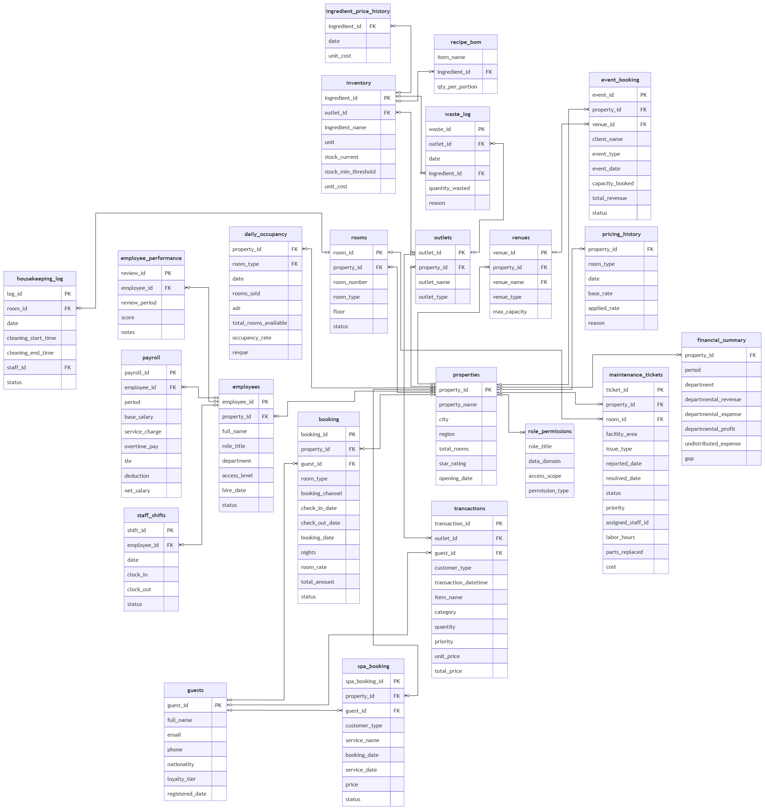
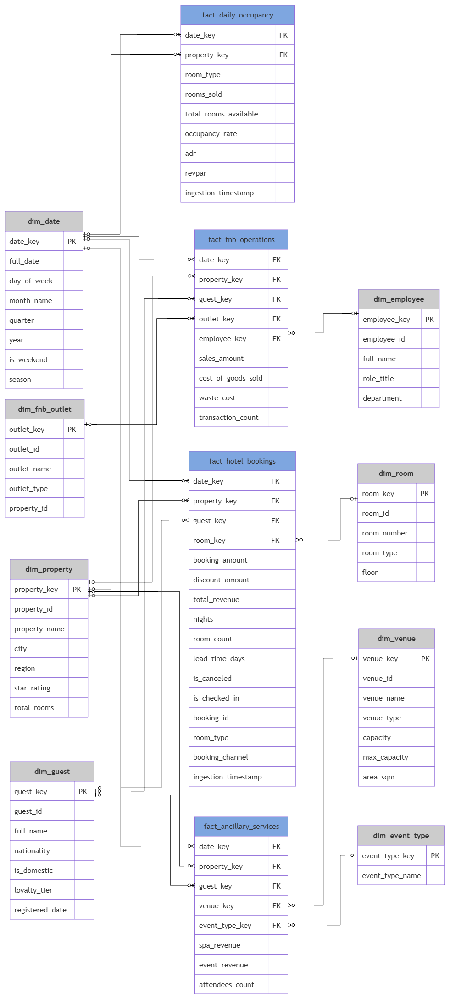

# IndoHotel Data Warehouse

Data Warehouse สำหรับวิเคราะห์การดำเนินงานของธุรกิจโรงแรมและรีสอร์ท โดยใช้ **dbt + DuckDB + Streamlit** ตั้งแต่การเตรียมข้อมูลดิบ การทำ Data Transformation การสร้าง Galaxy Schema ไปจนถึง Interactive Dashboard

---

## 👥 สมาชิกในกลุ่ม (Team Members)

* **673020253-2 ธนพล ท้าวนอ**
* **673020255-8 บุญญานุช นันดี**
* **673020271-0 อุดมศักดิ์ พระเสนา**
* **673020627-7 ศุภณัฏฐ์ ปุณมา**
* **673020638-7 พิชญธิดา ขัตติยะ**
* **673020639-5 ศศิภัทชา เจียรเจริญกิจ**

---

## 🏨 ข้อมูลจำเพาะของโครงงาน (Domain & Architecture)

### Domain

โครงงานอยู่ใน Domain ของ **ธุรกิจโรงแรมและรีสอร์ท** ครอบคลุมกระบวนการสำคัญ ได้แก่

* การจองห้องพัก (Hotel Booking)
* อาหารและเครื่องดื่ม (F&B)
* Spa
* Event และ Venue
* Occupancy
* Employee และ Hotel Operations

### Dataset Source

ใช้ชุดข้อมูลจำลองการดำเนินงานของกลุ่มโรงแรมจาก:

[Kaggle — Indonesian Hotel Group Operations Data](https://www.kaggle.com/datasets/ardiyanto24/indonesian-hotel-group-operations-data)

### Architecture

โครงงานแบ่งออกเป็น 2 ส่วนหลัก

```text
Raw Dataset
     │
     ▼
Staging Layer
     │
     ▼
Data Warehouse
     │
     ▼
Streamlit Dashboard
```

---

### Operational Database (ER Diagram)

ระบบต้นทางเป็นข้อมูลเชิงปฏิบัติการที่มีโครงสร้างแบบ Relational Database โดยข้อมูลต้นทางถูกนำมาเตรียมเข้าสู่ Staging Layer ก่อนสร้าง Data Warehouse



---

### Data Warehouse (Galaxy Schema)

Data Warehouse ใช้แนวคิด **Dimensional Modeling / Galaxy Schema**

ประกอบด้วย

#### Fact Tables — 5 ตาราง

| Fact Table                 | หน้าที่                                                        |
| -------------------------- | -------------------------------------------------------------- |
| `fact_hotel_bookings`      | ข้อมูลการจองห้องพัก รายได้ จำนวนคืน Lead Time และ Cancellation |
| `fact_fnb_operations`      | รายได้และต้นทุนจาก F&B                                         |
| `fact_ancillary_services`  | ข้อมูลบริการเสริม Spa และ Event                                |
| `fact_daily_occupancy`     | Occupancy, ADR และ RevPAR รายวัน                               |
| `fact_hotel_operations_hr` | Payroll, Employee Performance และ Maintenance                  |

#### Dimension Tables — 8 ตาราง

| Dimension Table  | หน้าที่                                 |
| ---------------- | --------------------------------------- |
| `dim_date`       | วัน เดือน ปี ฤดูกาล และ Weekday/Weekend |
| `dim_property`   | ข้อมูลโรงแรม/สาขา                       |
| `dim_guest`      | ข้อมูลลูกค้า สัญชาติ และ Loyalty Tier   |
| `dim_room`       | ข้อมูลห้องพักและประเภทห้อง              |
| `dim_employee`   | ข้อมูลพนักงาน                           |
| `dim_fnb_outlet` | ข้อมูล Outlet ของ F&B                   |
| `dim_venue`      | ข้อมูลสถานที่จัดงาน                     |
| `dim_event_type` | ข้อมูลประเภท Event                      |



รายละเอียดการออกแบบจาก Business Questions สามารถดูได้ที่:

**[Business Questions → Data Warehouse Schema Design](./BUSINESS_QUESTIONS_TO_SCHEMA.md)**

---

## 📊 คำถามทางธุรกิจ (Business Questions 15 ข้อ)

Data Warehouse ถูกออกแบบเพื่อรองรับ Business Questions จำนวน **15 ข้อ** โดยแบ่งเป็น 4 กลุ่มหลัก และแต่ละคำถามสามารถนำข้อมูลจาก Fact และ Dimension Tables มาวิเคราะห์เพื่อสนับสนุนการตัดสินใจทางธุรกิจได้

# Hotel Business Questions — 15 Questions

| No. | Question | Measure | Data Sources | Business Values |
|---|---|---|---|---|
| **1** | โรงแรมทั้ง 5 สาขา ทำรายได้รวมได้กี่บาท และขายห้องพักได้ทั้งหมดกี่คืน | - รายได้รวม<br>- จำนวนคืนที่ขายได้ | - `fact_hotel_bookings`<br>- `dim_date`<br>- `dim_property` | ประเมินขนาดธุรกิจ และติดตามผลประกอบการโดยรวม |
| **2** | ในรอบปี รายได้ของโรงแรมพุ่งสูงในช่วงเดือนไหน และช่วงเดือนไหนที่รายได้ตกต่ำ | - ยอดรายได้รวมรายเดือน | - `fact_hotel_bookings`<br>- `dim_date`<br>- `dim_property` | ช่วยวิเคราะห์แนวโน้มรายได้ และระบุช่วงเวลา Peak & Low Season |
| **3** | รายได้ที่โรงแรมได้จากวันธรรมดาเทียบกับวันหยุดสุดสัปดาห์ | - รายได้รวม | - `fact_hotel_bookings`<br>- `dim_date`<br>- `dim_property` | ช่วยให้เข้าใจรูปแบบรายได้ตามวันและพฤติกรรมการเข้าพักของลูกค้า |
| **4** | บริการเสริมแต่ละอย่างทำรายได้รวมกี่บาท และมีคนมาใช้บริการกี่คน | - รายได้รวม<br>- จำนวนคนที่มาใช้บริการ | - `fact_fnb_operations`<br>- `fact_ancillary_services`<br>- `dim_date`<br>- `dim_property` | ช่วยระบุบริการเสริมที่เป็นแหล่งรายได้สำคัญของโรงแรม |
| **5** | ห้องพักของโรงแรมแต่ละสาขาถูกจองเป็นกี่เปอร์เซ็นต์เมื่อเทียบกับจำนวนห้องในแต่ละสาขา | - เปอร์เซ็นต์ห้องพักที่ถูกจอง | - `fact_daily_occupancy`<br>- `dim_property` | ช่วยเปรียบเทียบประสิทธิภาพการขายห้องพักระหว่างแต่ละสาขา |
| **6** | สมาชิกแต่ละระดับกลับมาพักซ้ำบ่อยแค่ไหน | - จำนวนการพักซ้ำ | - `fact_hotel_bookings`<br>- `dim_guest`<br>- `dim_property`<br>- `dim_date` | ช่วยวิเคราะห์ความสัมพันธ์ระหว่างสมาชิกแต่ละระดับและพฤติกรรมการกลับมาเข้าพักซ้ำ |
| **7** | ลูกค้า 5 สัญชาติแรกที่มาพักมากที่สุด มียอดการจองกี่รายการ | - จำนวนรายการการจอง | - `fact_hotel_bookings`<br>- `dim_guest`<br>- `dim_property`<br>- `dim_date` | ช่วยระบุตลาดลูกค้าหลักตามสัญชาติและตลาดที่สร้างยอดจองสูง |
| **8** | ลูกค้าในประเทศและนอกประเทศใช้บริการด้านอาหารและสปาทั้งหมดกี่ครั้ง | - จำนวนการใช้บริการ | - `fact_fnb_operations`<br>- `fact_ancillary_services`<br>- `dim_guest`<br>- `dim_date`<br>- `dim_property` | ช่วยเปรียบเทียบพฤติกรรมการใช้บริการของลูกค้าในประเทศและนอกประเทศ |
| **9** | ในแต่ละสาขา ลูกค้าเข้าพักเฉลี่ยกี่คืนต่อการจอง 1 ครั้ง | - จำนวนการเข้าพัก | - `fact_hotel_bookings`<br>- `dim_guest`<br>- `dim_property`<br>- `dim_date` | ช่วยวิเคราะห์ระยะเวลาเข้าพักเฉลี่ยและพฤติกรรมการเข้าพักของลูกค้า |
| **10** | ลูกค้าจองห้องพักล่วงหน้าเฉลี่ยกี่วัน | - จำนวนวันที่จองล่วงหน้า | - `fact_hotel_bookings`<br>- `dim_property`<br>- `dim_date` | ช่วยวิเคราะห์พฤติกรรมการจองล่วงหน้าและรูปแบบการวางแผนเดินทางของลูกค้า |
| **11** | ห้องพักแต่ละแบบทำรายได้กี่บาท | - รายได้รวม | - `fact_hotel_bookings`<br>- `dim_room`<br>- `dim_property`<br>- `dim_date` | ช่วยระบุประเภทของห้องพักที่ได้รับความนิยมและทำรายได้สูงสุด |
| **12** | ห้องพักแต่ละแบบโดนยกเลิกกี่เปอร์เซ็นต์เมื่อเทียบกับยอดจองทั้งหมด | - จำนวนการยกเลิก | - `fact_hotel_bookings`<br>- `dim_room`<br>- `dim_property`<br>- `dim_guest` | ช่วยวิเคราะห์ความเสี่ยงด้านการยกเลิกของห้องพักแต่ละประเภท |
| **13** | สถานที่ที่ใช้จัดกิจกรรมแต่ละแบบถูกใช้งานกี่ครั้ง | - จำนวนการใช้สถานที่ | - `fact_ancillary_services`<br>- `dim_venue`<br>- `dim_property`<br>- `dim_date` | ช่วยวิเคราะห์ปริมาณการใช้สถานที่จัดการแต่ละประเภท |
| **14** | กิจกรรมแต่ละประเภทถูกจัดทั้งหมดกี่ครั้ง | - จำนวนการจัดกิจกรรม | - `fact_ancillary_services`<br>- `dim_event_type`<br>- `dim_date`<br>- `dim_property` | ช่วยระบุประเภทของกิจกรรมที่มีรายได้สูงและจัดบ่อย |
| **15** | กิจกรรมประเภทใดที่ทำรายได้มากที่สุด | - รายได้รวม | - `fact_ancillary_services`<br>- `dim_event_type`<br>- `dim_date`<br>- `dim_property` | ช่วยระบุประเภทของกิจกรรมที่สร้างรายได้สำคัญให้โรงแรม |

---

## 🔄 กระบวนการ ETL / ELT Pipeline

กระบวนการ ETL/ELT ของโปรเจกต์นี้ใช้สถาปัตยกรรม **Modern Data Stack (dbt + DuckDB)** ในการสกัด แปลง และโหลดข้อมูลจากระบบปฏิบัติการ (OLTP) เข้าสู่ Data Warehouse (OLAP) โดยแบ่งออกเป็น 3 ขั้นตอนหลัก:

### 1. Extract (การสกัดข้อมูลดิบ)

* **Data Sources:** สกัดข้อมูลดิบจากไฟล์ Flat Files (CSV ทั้งหมด 23 ไฟล์) ในโฟลเดอร์ `datasets/` ซึ่งจำลองจากระบบปฏิบัติการของโรงแรม
* **DuckDB Source Integration:** ใช้ไฟล์กำหนดค่า `src_indohotel.yml` เพื่อเชื่อมต่อ DuckDB เข้ากับไฟล์ CSV โดยตรง ทำให้สามารถ Query ข้อมูลดิบได้ด้วย SQL โดยไม่ต้องโหลดเข้า Database อื่นก่อน

### 2. Transform (การแปลงและทำความสะอาดข้อมูล)

กระบวนการ Transform แบ่งออกเป็น 2 ชั้นหลัก (Layered Architecture):

#### A. Staging Layer (`stg_*.sql`)

ทำความสะอาดข้อมูลดิบ จัดระเบียบชนิดข้อมูล (Type Casting) และใส่ Business Logic ระดับเริ่มต้นรวม 23 โมเดล โดยเฉพาะตาราง **`stg_guests`** ที่ต้องผ่านกระบวนการ Data Cleaning เชิงลึก เนื่องจาก **ข้อมูลดิบ (Raw Data) ในไฟล์ CSV ต้นทางมีความสกปรกและไม่เป็นมาตรฐาน (Messy & Inconsistent Data)** ดังนี้:

* **การแก้ปัญหาความหมายเดียวกันแต่เขียนไม่เหมือนกัน (Variations & Synonyms):** ข้อมูลดิบปะปนกันระหว่างชื่อประเทศ ชื่อเมือง และดินแดน (เช่น มีทั้ง `'KOREA'`, `'SOUTH KOREA'`, `'REPUBLIC OF KOREA'`, `'SEOUL'`, `'BUSAN'`) จึงต้องใช้ `CASE WHEN` ร่วมกับ `upper()` และ `trim()` เพื่อรวมให้เป็นมาตรฐานสากลเดียวคือ `'South Korea'`
* **การแก้ปัญหาคำย่อและรูปแบบไม่เป็นทางการ (Abbreviations):** แปลงคำย่อกระจัดกระจาย เช่น `'USA'`, `'US'`, `'UK'`, `'PRC'`, `'UAE'` ให้เป็นชื่อทางการที่ถูกต้อง
* **การจัดการชื่อประเทศทางประวัติศาสตร์หรือชื่อทางการยาวๆ (Historical & Formal Names):** แปลงชื่อเก่าหรือชื่อทางการ เช่น `'SWAZILAND'` เป็น `'Eswatini'` หรือ `'LIBYAN ARAB JAMAHIRIYA'` เป็น `'Libya'`
* **การจัดการค่าว่างและความผิดปกติ (Nulls, Blanks & Typos):** ดักเคสที่เป็น `NULL`, ข้อความว่าง (`''`), หรือดินแดนกำกวม ให้ถูกจัดหมวดหมู่รวมกันไปที่ `'Others'` อย่างปลอดภัย
* **Metadata Logging:** เพิ่มฟิลด์ `ingestion_timestamp` ด้วย `current_localtimestamp()` เพื่อบันทึกเวลาที่ข้อมูลถูกดึงเข้าสู่ Pipeline
* **Staging อื่นๆ:** เช่น `stg_bookings` (ทำความสะอาดสถานะการจอง), `stg_fnb_transactions` (คำนวณราคาขายและต้นทุน), และ `stg_employees` (จัดกลุ่มแผนกและระดับการเข้าถึง)

#### B. Warehouse Layer (`dim_*.sql` และ `fact_*.sql`)

รวมข้อมูลจาก Staging Layer มาสร้างเป็น **Galaxy Schema** รวม 13 ตาราง:

* **Surrogate Key Generation:** สร้าง Primary Key ใหม่ของตาราง Dimension โดยการทำ Hashing แบบ MD5 จาก Business Keys (เช่น `guest_key`, `property_key`, `room_key`) และสร้าง `date_key` แบบ Integer (`YYYYMMDD`)
* **Fact Calculation & Metrics:** คำนวณค่าตัวชี้วัดเชิงปริมาณ (Measures) เช่น `total_revenue`, `cost_of_goods_sold`, `waste_cost`, `lead_time_days`, `occupancy_rate`, `adr`, และ `revpar`

### 3. Load & Data Quality Testing (การโหลดและการทดสอบข้อมูล)

* **Automated Load Execution:** โหลดข้อมูลที่แปลงแล้วลงสู่คลังข้อมูล DuckDB ด้วยคำสั่ง `dbt run` โดยระบบจะจัดการลำดับการสร้างตาราง Dimension ก่อน Fact Tables เพื่อรักษาความสัมพันธ์ของข้อมูล (Referential Integrity)
* **Data Quality Control:** ทำการทดสอบคุณภาพข้อมูลอัตโนมัติด้วยคำสั่ง `dbt test` ครอบคลุม 24 Data Tests ผ่านไฟล์ `schema.yml`:

  * **`unique` Test:** ตรวจสอบความซ้ำซ้อนของ Surrogate Primary Keys ในทุก Dimension Tables
  * **`not_null` Test:** ตรวจสอบว่าไม่มีค่า Null ในคอลัมน์ Primary Keys และ Business Keys สำคัญ
* **ผลการทดสอบ:** ผ่านการทดสอบคุณภาพข้อมูลสำเร็จ 100%

---

## 📈 Interactive Dashboard (Streamlit)

แพลตฟอร์มการแสดงผลข้อมูลเชิงโต้ตอบ (Interactive Dashboard) พัฒนาขึ้นด้วย **Streamlit** เชื่อมต่อโดยตรงกับ DuckDB Data Warehouse เพื่อตอบโจทย์คำถามเชิงกลยุทธ์ทั้ง 15 ข้อขององค์กร

* **🔗 ลิงก์เข้าชมระบบ:** [👉 คลิกที่นี่เพื่อใช้งาน Streamlit Dashboard (INDOHOTEL)](https://projectdatawarehouse-tee-we-lux.streamlit.app/)

| แท็บการใช้งาน (Tab)         | ตัวชี้วัดสำคัญ (Key Metrics)                                | กราฟและเครื่องมือวิเคราะห์ (Visualizations)                                                                                                                                                                                                       |
| :-------------------------- | :---------------------------------------------------------- | :------------------------------------------------------------------------------------------------------------------------------------------------------------------------------------------------------------------------------------------------ |
| **1. รายได้และผลประกอบการ** | ยอดขายรวม (Total Revenue), จำนวนคืนที่จอง (Nights)          | • กราฟเส้นแนวโน้มรายได้ตามช่วงเดือน/ฤดูกาล<br>• กราฟโดนัทสัดส่วนยอดขายวันธรรมดา vs วันหยุดสุดสัปดาห์<br>• การแสดงผลสัดส่วนรายได้และผู้ใช้บริการเสริม (F&B, Spa, Event)<br>• กราฟอัตราการเข้าพักเฉลี่ย (Occupancy Rate) แยกตามสาขา                 |
| **2. ลูกค้าและพฤติกรรม**    | ค่าเฉลี่ยการเข้าพักซ้ำตาม Loyalty Tier, สัญชาติลูกค้า Top 5 | • กราฟแท่งแสดงอัตราการเข้าพักซ้ำตามระดับสมาชิก<br>• กราฟแท่งแนวนอนแสดงสัญชาติลูกค้าสูงสุด 5 อันดับแรก<br>• กราฟเปรียบเทียบการใช้บริการ Food และ Spa ระหว่างลูกค้าในประเทศและต่างชาติ<br>• กราฟระยะเวลาเข้าพักเฉลี่ย (Nights Stayed) ตามสาขาโรงแรม |
| **3. ห้องพักและการจอง**     | ระยะเวลาการจองล่วงหน้าเฉลี่ย (Lead Time)                    | • กราฟแท่งแสดงประเภทห้องพักที่สร้างรายได้หลักสูงสุดพร้อมจำนวนการจอง<br>• กราฟแท่งแสดงอัตราการยกเลิกการจอง (%) แยกตามประเภทห้องพัก                                                                                                                 |
| **4. ปฏิบัติการและสถานที่** | จำนวนการจองสถานที่และรายได้จากการจัดงาน                     | • กราฟแท่งแสดงประเภทสถานที่จัดงาน (Venue Type) ที่มีการจองสูงสุด<br>• กราฟเปรียบเทียบจำนวนครั้งและรายได้รวมแยกตามประเภทกิจกรรมจัดงาน (Event Type Breakdown)                                                                                       |

---

## 🚀 วิธีการรันโปรเจกต์ (Quickstart Guide)

ทำตามขั้นตอนด้านล่างเพื่อรันโปรเจกต์ในเครื่องของคุณ:

### 1. โคลน Repository และเข้าไปที่โฟลเดอร์โปรเจกต์

```bash
git clone https://github.com/Thanaphon-673020253-2/project_DW.git
cd project_DW
```

### 2. Set up the environment

```bash
python3 -m venv .venv
source .venv/bin/activate
```

> สำหรับ Windows สามารถใช้:

> ```powershell
> .venv\Scripts\activate
> ```

### 3. Install requirements package

```bash
pip install --upgrade pip
pip install -r requirements.txt
```

### 4. Run DBT

```bash
cd indohotel

dbt debug
dbt run
dbt test

cd ..
```

### 5. Run Streamlit Dashboard

```bash
streamlit run app.py
```
